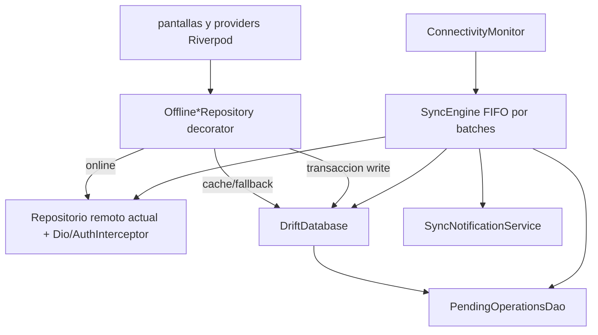
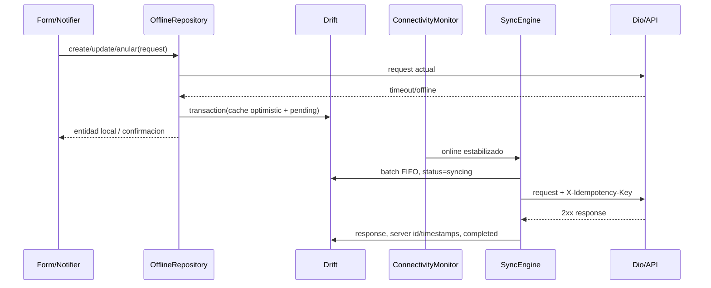

# Design: App movil fixes offline

## Contexto y objetivos

Este change modifica exclusivamente `flutter/`. La aplicacion ya usa Clean
Architecture (`presentation -> domain <- data`), Riverpod, Dio y
`StatefulShellRoute.indexedStack`. El objetivo es corregir los fallos de
navegacion, dashboard, chat y formularios, y agregar offline-first acotado para
ventas, gastos, compras y movimientos, sin modificar backend, contratos REST ni
frontend web. La base actual contiene 77 tests y los DTOs generados con
`freezed`/`json_serializable` no se editaran manualmente.

La implementacion se dividira en cortes compilables: infraestructura local y
providers; repositorios/sync; router/FAB; dashboard y chat; componentes y
migracion de formularios; documentacion y verificacion.

## Enfoque tecnico

Las lecturas comerciales seguiran el flujo `remote -> cache`; si falla por
conectividad, se servira el ultimo snapshot local y se mostrara un indicador
offline. Las escrituras usaran un decorator de cada repositorio existente: si
la red esta disponible se conserva el request actual; si no, se escribe en una
transaccion SQLite (cache optimista + cola durable). El sincronizador no se
inserta en widgets ni en los DTOs: vive en `data/`, se expone por providers
Riverpod y recibe la sesion mediante interfaces.

El sincronizador sera foreground/resume/connectivity-driven. No se agrega
`workmanager` en este change: no existe requisito de sync con la app cerrada y
se evitara un wake-up nativo sin evidencia de valor.

## Arquitectura de componentes



## ADRs

### ADR-22: Drift como almacenamiento local versionado

**Decision:** usar Drift sobre SQLite nativo, con `schemaVersion` explicito,
migraciones incrementales y DAOs tipados. La base sera abierta mediante un
executor nativo en Android/iOS; en Web, donde no se habilite SQLite persistente
en esta entrega, los providers conservaran el comportamiento remoto existente.

**Alternativas consideradas:** `sqflite` (menos tipado y migraciones menos
declarativas), Hive (sin consultas relacionales adecuadas para FIFO/retencion),
y una cache en memoria.

**Rationale:** Drift encaja con las consultas ordenadas, transacciones,
streams y migraciones requeridas por R66/R69/R71. Aislar el executor permite
mantener el target Web sin fingir soporte offline persistente donde no haya
SQLite configurado.

### ADR-23: Esquema de cola y cache comercial

**Decision:** crear estas tablas Drift:

- `pending_operations`: `id`, `operation_type`, `endpoint`, `http_method`,
  `user_id`, `idempotency_key`, `payload_json`, `created_at`, `status`,
  `attempt_count`, `next_retry_at`, `last_error`, `response_json`,
  `local_record_key`.
- `cached_sales`, `cached_expenses`, `cached_purchases` y
  `cached_movements`: `local_key`, `server_id` nullable, `payload_json`,
  `server_updated_at` nullable, `local_updated_at`, `sync_state` y
  `idempotency_key` nullable.

`status` sera un enum de dominio serializado como
`pending|syncing|completed|auth_required|failed`; `operation_type` sera
`sale|expense|purchase|movement|sale_void|purchase_void`. Los payloads se
guardaran como JSON canonico, no como objetos Dart serializados.

Cada alta/modificacion offline ejecutara una transaccion que inserta cola y
cache optimista. Los DAOs seran `PendingOperationsDao` y un DAO por cache; no
se cargara toda la cola a memoria. `completed` se conservara solo durante la
ventana de retencion para auditoria local y deduplicacion reciente.

**Alternativas consideradas:** una tabla polimorfica unica para cache, o
guardar listas completas como un blob.

**Rationale:** la cola necesita una tabla unica para FIFO y estados, mientras
que las cuatro tablas de cache permiten retencion, consultas y evolucion
independiente por modulo. Mantener `payload_json` evita acoplar Drift a los
DTOs generados y conserva los contratos actuales.

### ADR-24: Decorators de repositorio para offline-first

**Decision:** conservar `VentaRepository`, `CompraRepository`,
`MovimientoRepository` y `GastoRepository` sin cambios publicos. Crear
`OfflineVentaRepository`, `OfflineCompraRepository`,
`OfflineMovimientoRepository` y `OfflineGastoRepository`, que decoran las
implementaciones actuales y delegan la serializacion de request/response a
adaptadores de `data/offline/`.

Los providers existentes de `commercial_providers.dart` expondran el decorator
con el repositorio remoto inyectado. `list()` intenta remoto, actualiza cache y
devuelve datos; ante error de conectividad devuelve cache. `create/update/anular`
intentan online y, ante ausencia de red, encolan y devuelven una entidad local
optimista. Errores 4xx de validacion no se convierten en offline.

**Alternativas consideradas:** modificar cada notifier y formulario, o
reescribir `commercial_repositories_impl.dart` como repositorio offline.

**Rationale:** el decorator respeta Clean Architecture, evita tocar logica de
negocio y hace que las pantallas existentes reciban el mismo contrato. La
decision mantiene Dio/AuthInterceptor y limita el cambio al borde de datos.

### ADR-25: Sync FIFO, backoff acotado y conflictos

**Decision:** `SyncEngine` consulta como maximo 10 operaciones por lote,
ordenadas por `created_at,id`, y procesa estrictamente FIFO por usuario. Antes
de enviar marca `syncing`; al exito marca `completed`, guarda
`response_json`, reemplaza el `server_id`/timestamps en cache y refresca el
registro local. Para timeout, 5xx o errores de transporte usa
`min(30s * 2^(attempt-1) + jitter, 30min)`, con maximo configurable de 5
intentos. Al superarlo marca `failed`.

Las operaciones envian `X-Idempotency-Key` y tambien lo conservan localmente;
el engine no duplica una operacion ya `completed`. Para cache se aplica
last-write-wins comparando `server_updated_at` con `local_updated_at`. En
stock/transacciones el response del backend es autoridad; 409/422 se marca
`failed` inmediatamente con mensaje accionable sanitizado y no se reintenta.

**Alternativas consideradas:** polling fijo, reintentos ilimitados, merge
automatico de cantidades y procesamiento paralelo.

**Rationale:** FIFO evita reordenar operaciones de inventario, los batches
limitan memoria y el backoff evita bateria consumida por errores persistentes.
No se inventa una resolucion de conflicto de negocio que el backend no soporta.
El header de idempotencia es aditivo; si una version del backend no lo
reconoce, queda como mitigacion local y se registra el riesgo de timeout
ambiguo, sin cambiar sus endpoints ni payloads.

### ADR-26: Estados de autenticacion y seguridad de la cola

**Decision:** crear operaciones offline solo desde una sesion que haya sido
autenticada previamente y conserve usuario/permisos locales. Un logout
voluntario impide crear nuevas operaciones, pero nunca borra las existentes.
Una sesion local aun visible puede crear en cola sin token valido; el envio
requiere token nuevo. Un 401 durante sync marca todas las operaciones no
completadas como `auth_required`, pausa el engine y permite que el login
existente lo reactive.

El JSON de payload y response se cifrara con una clave por instalacion
guardada en `flutter_secure_storage`; la base contiene solo metadata minima
legible. La clave no se elimina en `logout`; se elimina unicamente en una
limpieza de datos de aplicacion. Si el almacenamiento seguro no esta
disponible, se bloquea la creacion offline y se muestra un error seguro, sin
perder la sesion ni datos ya persistidos.

**Alternativas consideradas:** exigir token valido para guardar localmente,
guardar payload en texto plano, o limpiar la cola al cerrar sesion.

**Rationale:** el usuario puede trabajar con un JWT expirado tras dias offline,
pero debe haber pasado por login previamente. Preservar la cola satisface R68;
cifrar el contenido evita exponer montos, clientes y productos en SQLite.

### ADR-27: Monitor de red y ciclo de vida del sync

**Decision:** `ConnectivityMonitor` escucha `connectivity_plus`, aplica debounce
de 750 ms y emite solo transiciones estabilizadas. El evento online dispara
un sync; `AppLifecycleState.resumed` tambien dispara una ejecucion puntual.
No se usa timer de polling. El monitor, engine y stream se registran en
providers Riverpod con `ref.onDispose` y un mutex evita ejecuciones
concurrentes.

**Alternativas consideradas:** polling cada N segundos, ejecutar un isolate
permanente, o agregar `workmanager` ahora.

**Rationale:** connectivity es una senal para despertar el proceso, no prueba
de Internet; la peticion Dio confirma la red real. El timeout/backoff maneja la
senal falsa y el dispose evita fugas de bateria/memoria.

### ADR-28: Notificaciones locales agrupadas

**Decision:** usar `flutter_local_notifications` con canal Android
`sync_status` (baja importancia, grupo `ferreplus_sync`) y la configuracion
equivalente en iOS. Solicitar permisos una vez desde el servicio, manejar
rechazo sin lanzar excepcion y actualizar una unica notificacion agrupada.
Notificar cuando count(pending/syncing/auth_required) > 0 al volver online y
cuando una operacion pasa a `failed` o `auth_required`.

Los textos seran genericos: "Operaciones pendientes de sincronizar",
"Sesion requerida para sincronizar" y "Error de sincronizacion: revisa la
app". Nunca incluiran cliente, monto, producto, payload o endpoint.

**Alternativas consideradas:** snackbar unicamente, una notificacion por
operacion, Firebase/FCM o contenido detallado.

**Rationale:** una notificacion agrupada informa sin spam ni datos sensibles y
funciona localmente aun sin servicio push. La UI seguira mostrando el estado
aunque el permiso sea denegado.

### ADR-29: Navegacion canonica del shell y toggle del FAB

**Decision:** definir una tabla unica e inmutable:

```dart
const branchInitialRoutes = <int, String>{
  0: '/', 1: '/productos', 2: '/ventas', 3: '/reportes', 4: '/mas',
};
```

`ShellScaffold` obtiene el branch del path actual. Si se toca el destino
activo, ejecuta `context.go(branchInitialRoutes[index]!)`; si se toca otro,
usa `navigationShell.goBranch(index, initialLocation: false)` para conservar
el stack. Si la rama destino esta mostrando una ruta secundaria que no
corresponde al destino solicitado, navega explicitamente a su ruta canonica.
Por ello `/gastos` -> Ventas siempre termina en `/ventas`, mientras Productos
conserva su scroll al volver.

`ChatFloatingActionButton` lee `GoRouterState.of(context).uri.path`; fuera de
`/chat` guarda la ruta actual (si es segura y autenticada) en
`chatPreviousLocationProvider` y navega a `/chat`. En `/chat` muestra close y
vuelve a esa ruta, o `/` si fue deep link directo. El wrapper draggable no se
modifica.

**Alternativas consideradas:** basar la decision en `currentIndex`, usar
`initialLocation` para todos los taps, `push('/chat')`, o duplicar rutas en la
barra.

**Rationale:** `currentIndex` no identifica la ruta secundaria dentro de una
rama. Separar seleccion de rama y ruta canonica corrige el bug sin eliminar el
stack persistente ni romper guards/deep links.

### ADR-30: Dashboard, chat y formularios como cambios de presentacion

**Decision:** el dashboard calcula una vez el `DateRange`; acepta
`ventasPorDia` solo si contiene todos los intervalos y, en caso contrario,
usa `reportSalesProvider(range)`. Semana/mes agrupan por dia y ano por mes,
incluyendo cero para cada intervalo.

El chat separara `ChatMessageList`, `ChatAssistantLoadingBubble` y
`ChatComposer`. El loading sera una burbuja assistant debajo del ultimo
mensaje, con tres puntos animados y soporte de reduced motion. Las burbujas
usaran `FractionallySizedBox(widthFactor: .85)`. Un `ScrollController` se
dispose en la pagina y anima al final despues de send/receive. El composer
sera `SafeArea` + `Padding(bottom: MediaQuery.viewInsetsOf(context).bottom)`,
`Container` con `minHeight/maxHeight`, `TextField` multilinea con scroll
interno, boton integrado y contador discreto `0/1000`.

Los formularios recibiran `AppFormField`, `AppDropdownField` y
`AppFormSection`. Los campos aceptaran los mismos `controller`, `initialValue`,
`keyboardType`, `enabled`, `obscureText`, `validator`, `onChanged` y
`decoration` compatibles con `TextFormField`/dropdown; la validacion seguira
delegada al `Form` de cada pantalla. `AppFormSection` recibira `title` y
`children`, y todos usaran `AppSpacing` sin magic numbers.

**Alternativas consideradas:** cambiar providers/modelos, usar `Positioned`,
reducir fuentes para caber, o crear una abstraccion de formulario con estado
propio.

**Rationale:** se corrige la composicion sin tocar prompts, RAG, endpoints,
validaciones ni logica POS. Los componentes compartidos concentran
accesibilidad y responsive, pero el `FormState` sigue siendo propiedad de cada
pantalla.

### ADR-31: Retencion, limites y rollout

**Decision:** retener operaciones `completed` durante 7 dias; mantener
`pending/syncing/auth_required/failed` hasta resolucion manual o limpieza de
datos. Limitar la cola a 500 operaciones y 20 MB de payload cifrado; al
alcanzar el limite se bloquean nuevas escrituras offline con mensaje claro.
Ejecutar cleanup al abrir la base y despues de cada sync exitoso.

La migracion Drift sera aditiva y preservara primero cola/cache. No se activa
background sync. Se podra desactivar el engine y notificaciones mediante
`offlineSyncEnabledProvider` de emergencia, sin borrar tablas ni alterar el
flujo online.

**Alternativas consideradas:** borrar por cantidad sin distinguir estados,
limpiar toda la base en logout, o rollout con cambios de backend.

**Rationale:** los limites evitan crecimiento sin control y permiten una
politica predecible en dispositivos modestos. Un rollout aditivo hace posible
revertir UI/sync sin perder operaciones almacenadas.

## Flujos principales

### Escritura offline y sincronizacion



### 401 durante sync

```text
API 401 -> AuthInterceptor.onUnauthorized -> logout existente -> /auth
       -> SyncEngine marca no completadas como auth_required y pausa
login valido -> AuthNotifier authenticated -> SyncEngine.resume() -> FIFO
```

### Lectura offline

```text
list() -> remote OK -> decode -> upsert cache -> UI online
       -> timeout/connection -> query cache -> UI + OfflineBanner
       -> cache vacia -> OfflineEmptyState
```

## Estructura de archivos propuesta

| Archivo | Accion | Descripcion |
|---|---|---|
| `flutter/pubspec.yaml` | Modificar | `drift`, `sqlite3_flutter_libs`, `connectivity_plus`, `flutter_local_notifications`, `cryptography` y generator de Drift; versiones compatibles con Flutter 3.38/Dart 3.10. |
| `flutter/lib/data/local/app_database.dart` | Crear | Tablas, `schemaVersion`, migraciones y executor por plataforma. |
| `flutter/lib/data/local/app_database.g.dart` | Generado | Codigo Drift; nunca editar manualmente. |
| `flutter/lib/data/local/tables/*.dart` | Crear | `PendingOperations` y cuatro tablas de cache. |
| `flutter/lib/data/local/daos/*.dart` | Crear | Queries FIFO, cache, retencion y streams. |
| `flutter/lib/domain/models/offline_models.dart` | Crear | enums de tipo/estado, `PendingOperation`, `OfflineList<T>` y resultado de sync. |
| `flutter/lib/domain/repositories/offline_repository.dart` | Crear | Contratos de cola, cache y sincronizacion independientes de Drift/UI. |
| `flutter/lib/data/offline/payload_codec.dart` | Crear | JSON canonico, cifrado/descifrado y mensajes sanitizados. |
| `flutter/lib/data/offline/offline_*_repository.dart` | Crear | Decorators de los cuatro repositorios comerciales. |
| `flutter/lib/data/services/connectivity_monitor.dart` | Crear | Listener debounce y lifecycle/resume. |
| `flutter/lib/data/services/sync_engine.dart` | Crear | Mutex, batches, backoff, 401, 409/422, cleanup y estado. |
| `flutter/lib/data/services/sync_notification_service.dart` | Crear | Canal, permisos y notificacion agrupada sin datos sensibles. |
| `flutter/lib/core/providers/offline_providers.dart` | Crear | DB, DAOs, repositories decorados, monitor y engine Riverpod. |
| `flutter/lib/presentation/shared/widgets/offline_banner.dart` | Crear | Indicador visible de cache/offline y empty state especifico. |
| `flutter/lib/presentation/features/commercial_providers.dart` | Modificar | Inyectar decorators manteniendo interfaces actuales. |
| `flutter/lib/data/interceptors/auth_interceptor.dart` | Modificar | Notificar al offline coordinator antes/despues del logout por 401. |
| `flutter/lib/core/providers/auth_providers.dart` | Modificar | Reanudar sync despues de login y no limpiar cola en logout. |
| `flutter/lib/core/routing/app_router.dart` | Modificar | Tabla branch->ruta, guards y provider de ruta previa del chat. |
| `flutter/lib/presentation/shell/shell_scaffold.dart` | Modificar | Navegacion explicita y preservacion de branch state. |
| `flutter/lib/presentation/shell/chat_floating_action_button.dart` | Modificar | Toggle, icono, tooltip y semantics dinamicos. |
| `flutter/lib/presentation/features/dashboard/dashboard_provider.dart` | Modificar | Cobertura completa del rango y agrupacion periodica. |
| `flutter/lib/presentation/features/chat/pages/chat_page.dart` | Modificar | Lista/composer responsive y autoscroll. |
| `flutter/lib/presentation/features/chat/widgets/chat_assistant_loading_bubble.dart` | Crear | Burbuja animada de loading. |
| `flutter/lib/presentation/features/chat/widgets/chat_composer.dart` | Crear | TextField, boton, contador e insets. |
| `flutter/lib/presentation/shared/widgets/app_form_field.dart` | Crear | Wrapper tipado de `TextFormField` con API compatible. |
| `flutter/lib/presentation/shared/widgets/app_dropdown_field.dart` | Crear | Wrapper de dropdown con validator/decoration existentes. |
| `flutter/lib/presentation/shared/widgets/app_form_section.dart` | Crear | Titulo, semantics y spacing de seccion. |
| `flutter/lib/presentation/features/commercial_pages.dart` | Modificar | Venta, compra, movimiento y gasto: scroll, secciones y shared fields. |
| `flutter/lib/presentation/features/productos/productos_pages.dart` | Modificar | Producto: shared fields/dropdowns y spacing. |
| `flutter/lib/presentation/features/catalog_pages.dart` | Modificar | Categoria, proveedor y cliente. |
| `flutter/lib/presentation/features/admin_pages.dart` | Modificar | Usuario y rol, sin mover validaciones/permisos. |
| `flutter/android/app/src/main/AndroidManifest.xml` | Modificar | Permiso de notificaciones Android 13 y configuracion del plugin. |
| `flutter/ios/Runner/Info.plist` | Modificar | Permisos/categorias de notificacion cuando se genere en macOS. |
| `flutter/test/data/offline/**` | Crear | DAOs, migraciones, codec, decorators y sync engine. |
| `flutter/test/presentation/shell/**` | Modificar/crear | FAB, branch mapping, deep links y estado preservado. |
| `flutter/test/presentation/features/dashboard/**` | Modificar | Periodos parciales, ceros y agrupacion anual. |
| `flutter/test/presentation/features/chat/**` | Crear | Loading bubble, ancho, scroll, teclado y contador. |
| `flutter/test/presentation/shared/form_widgets_test.dart` | Crear | API, validator, labels, sections y spacing. |
| `flutter/integration_test/offline_sync_test.dart` | Crear | Flujo guardar offline, reinicio, login y sync con fakes. |
| `README.md` | Modificar | Seccion Flutter, comandos, arquitectura, UX y limites offline. |

No se modificaran `backend/`, `frontend/`, endpoints, modelos generados ni
prompts/RAG del chat.

## Interfaces y contratos

```dart
enum OfflineOperationType {
  sale, expense, purchase, movement, saleVoid, purchaseVoid,
}

enum PendingOperationStatus {
  pending, syncing, completed, authRequired, failed,
}

abstract interface class OfflineQueue {
  Future<void> enqueue(PendingOperation operation);
  Stream<int> watchPendingCount(int userId);
  Future<List<PendingOperation>> nextBatch({required int limit});
  Future<void> markSyncing(int id);
  Future<void> markCompleted(int id, Map<String, Object?> response);
  Future<void> markAuthRequired(int id);
  Future<void> markFailed(int id, String sanitizedError);
}

abstract interface class ConnectivityMonitor {
  Stream<bool> get stabilizedOnline;
}

abstract interface class SyncEngine {
  Future<void> syncNow();
  Future<void> resumeAfterLogin();
  Future<void> dispose();
}
```

Los decorators no agregaran metodos al dominio comercial. Para el cache, los
adaptadores tendran funciones puras `toCacheJson`/`fromCacheJson` y
`toOperation`, reutilizando `_saleRequest`, `_purchaseRequest` y equivalentes
existentes en `commercial_repositories_impl.dart` sin mover reglas de negocio.
Los errores persistidos se obtendran de `Failure`/`DioException` mediante un
sanitizador que elimina body, headers, tokens y datos de negocio.

## Estrategia de tests

Se preservan y ejecutan los 77 tests actuales antes y despues de cada corte.

| Capa | Cobertura | Enfoque |
|---|---|---|
| Unit | schema/migraciones, codec cifrado, estados, FIFO, backoff+jitter determinista, retencion, last-write-wins y date grouping | Drift en base temporal, reloj/jitter fake y fixtures JSON. Verificar que migrar N->N+1 conserva cola/cache. |
| Repository | fallback remoto->cache, escritura optimista, POST/PUT/void, no duplicado online, cache refresh y errores 4xx | Fakes de repositorio/Dio y `ProviderContainer` con overrides; comprobar endpoints/metodos/payloads existentes. |
| Sync | batches de 10, orden, retry 5xx/timeout, terminal 409/422, 401/auth_required, login resume, limite y cleanup | `FakePendingOperationsDao`, `FakeApiSender`, reloj controlado y conectividad manual. |
| Notifications | count agrupado, auth/error generico, permiso denegado | Fake `SyncNotificationService`; nunca debe aparecer payload sensible ni lanzar excepcion. |
| Widget | FAB open/close/icon/tooltip, Gastos->Ventas, deep link, cinco tabs; dashboard periodos; loading bubble, ancho 85%, composer/insets/contador; shared form fields/sections | `WidgetTester`, router de prueba, `MediaQuery` con teclado/text scale, `SemanticsTester` y providers overrideados. |
| Integration | guardar cada operacion offline, matar/reabrir app, recuperar red, login tras 401 y lectura cache | `integration_test` con fake API/DB temporal; Android como objetivo primario. iOS cuando exista macOS. |
| Regresion/build | 77 tests, `flutter analyze`, Android debug y Web sin romper el flujo online | Comandos de `flutter/AGENTS.md`; no editar generados y revisar memoria/bateria en profile. |

Casos de layout incluyen ancho estrecho, landscape, safe areas, teclado,
escala grande y reduced motion. El test de integracion no dependera de una
notificacion del sistema para validar la cola: verificara el servicio fake y el
estado visible en UI.

## Rendimiento, bateria y memoria

- Debounce de conectividad, sin polling y sin isolate permanente.
- Batches de 10, lectura paginada de cola y un solo request activo para
  conservar FIFO; JSON grande se cifra/decodifica fuera del build y se puede
  mover a `compute` si el profiling lo justifica.
- Streams de Drift filtrados por usuario y providers `autoDispose` para
  pantallas de listados; cerrar subscriptions y `ScrollController`.
- Cache solo de los cuatro listados, sin catalogos completos ni chat. Cleanup
  de completadas a 7 dias y limite 500/20 MB.
- Notificacion agrupada, no una notificacion por operacion.
- Medir en Android profile: frames al abrir lista, memoria de DB, duracion de
  sync, wake-ups y bateria en 30 minutos offline/online. No activar
  `workmanager` salvo que una medicion demuestre que foreground/resume no
  cubre el caso operativo.

## Riesgos tecnicos y mitigaciones

| Riesgo | Mitigacion |
|---|---|
| Un timeout puede dejar una transaccion aplicada y no confirmada; un backend que ignore `X-Idempotency-Key` podria duplicarla. | Persistir clave y estado, enviar header, no crear una segunda operacion local, mostrar estado ambiguo para revision y documentar la limitacion; validar soporte real del endpoint antes de release. |
| 401 dispara logout y elimina contexto UI mientras existe cola. | AuthInterceptor solo coordina el estado `auth_required`; logout no toca Drift/clave; login llama `resumeAfterLogin`. |
| Inventario rechazado por stock o validacion. | 409/422 terminal, mensaje accionable, no reintento infinito ni sobrescritura silenciosa. |
| Drift/plugins nativos rompen Web o iOS sin macOS. | Executor por plataforma, offline persistente solo en mobile, build Android obligatorio y smoke Web online; validacion iOS condicionada a macOS. |
| Base local crece o expone datos sensibles. | AES-GCM con clave en secure storage, limites, retencion, payload minimizado y sanitizacion de errores. |
| `StatefulShellRoute` pierde stack o deep link. | Tabla canonica unica, tests de cada branch/ruta secundaria y `goBranch` solo para cambios de rama. |
| Refactor de diez formularios altera validators/permisos. | Wrappers compatibles, migracion mecanica por pantalla, tests de mensajes/endpoints y `flutter analyze` por corte. |
| Composer/lista se ocultan con teclado o text scale. | `viewInsets`, SafeArea, constraints relativos, scroll interno, pruebas de 320/375 dp y escalas grandes; no `Positioned` ni `FittedBox`. |

## Migracion y rollout

La migracion de base comienza en `schemaVersion = 1` y todas las futuras
migraciones seran aditivas. Si la base no puede abrirse o descifrarse, la app
debe conservar el flujo remoto y presentar estado de almacenamiento local no
disponible; nunca borrar silenciosamente la cola.

El rollout recomendado es: (1) tablas/codec/DAOs y providers fake; (2)
decorators y sync con feature flag apagado; (3) activar cola y notificaciones
en Android; (4) router/FAB; (5) dashboard/chat; (6) formularios/README; (7)
perfil y suite completa. El rollback desactiva sync/notificaciones y deja las
tablas intactas para una entrega posterior; no requiere cambios de backend.

## Open Questions

None bloqueante. La especificacion ya decide re-login en lugar de refresh
automatico y deja background sync fuera salvo evidencia. Antes de release se
debe verificar empiricamente que el backend actual acepta la cabecera de
idempotencia; si no la procesa, el riesgo de timeout ambiguo debe quedar
aceptado explicitamente y no ocultarse como garantia de exactamente-una-vez.
